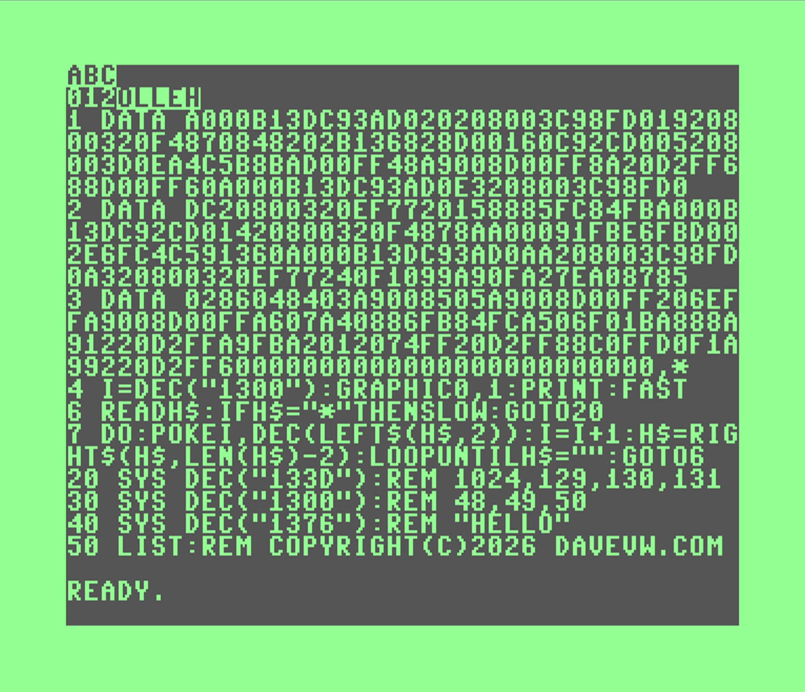

# extend-c128-BASIC

Samples on how to extend C128 BASIC syntax simply with 8502/6502 assembly.  

On the C64 we could parse for commas and numbers, but the C128 SYS command already does that for populating the registers.  Using :REM ... we can specify parameters in a C128 syntax compatible way that is similar yet necessarily different.

In the following example(*) parameters are passed to machine language routines via remarks.  The REM statements and arguments are required or running would produce a syntax error. 

* 1300 - chrout series of bytes
* 133D - poke bytes at address
* 1376 - reverse a string to output - literally, both ways - direction and colors

You can use your imagination on how this could be used for your benefit.

example:

    10 load "c128-extend.ml",8,1
    20 sys dec("133d"):rem 1024,129,130,131
    30 sys dec("1300"):rem 48,49,50
    40 sys dec("1376"):rem "hello"

(*)note: file doesn't exist -- used to abbreviate the example -- see data statements in screenshot instead

credit: [8bitshowandtell](https://www.youtube.com/c/8BitShowAndTell) did a video where a similar technique was shown like [RUN:123](https://youtu.be/mWemSlH0Xrg?si=oDUKyhV7mPzJ1_4b) command.   That was for a different purpose, but was inspiration for this extension exerciese.

Reimplemented without referring to the video, making sure could handle bytes, words (0..65535), and strings.  Exercise left to the developer to parse and use floating point numbers, and signed integers (-32768..32767).   Code was hand assembled in C128 monitor and VICE monitor.  These are necessary alternatives to the techniques shown in the repository [extend-c64-BASIC](https://github.com/davervw/extend-c64-BASIC)
